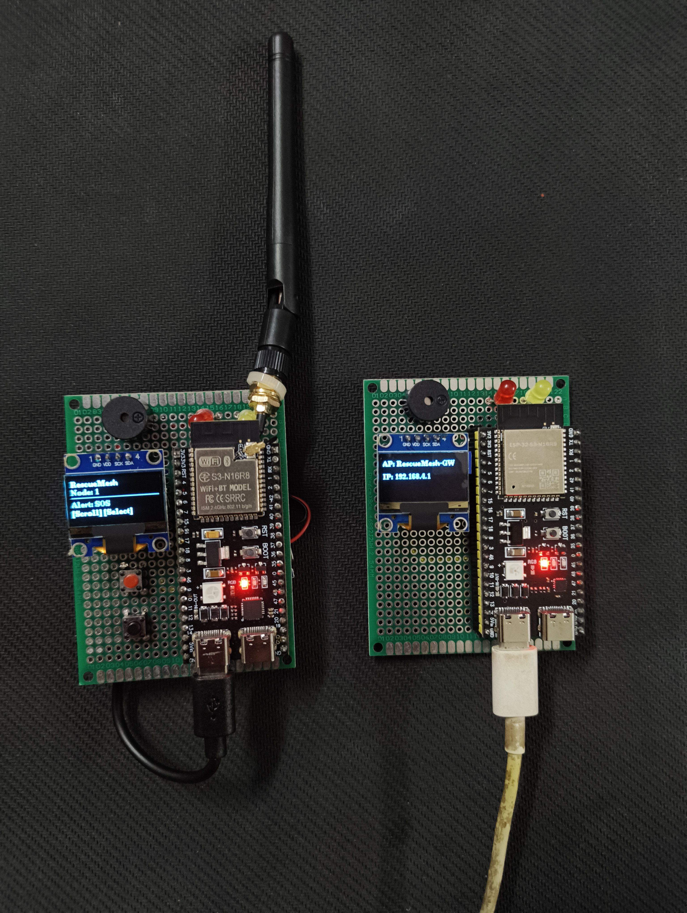

# SETU

**An offline ESP-NOW-based emergency alert system for disaster scenarios where cellular, Wi-Fi, or internet connectivity is unavailable.**

SETU is a two-node prototype that lets a victim send structured emergency alerts (SOS, Fire, Medical, Trapped, Safe) to a nearby gateway node using ESP-NOW, a low-latency, connectionless Wi-Fi-based protocol. The gateway node receives alerts, displays them on a live web dashboard, and persists them to flash memory so nothing is lost across power cycles.

---

## Final Build

*Completed SETU prototype — victim node and gateway node with OLED displays, status LEDs, and buzzer feedback.*

---

## What It Does

Each node is a self-contained device with an OLED display, buttons, status LEDs, and a buzzer that lets a user:

- **Scroll through and select an alert type** (SOS, FIRE, MEDICAL, TRAPPED, SAFE)
- **Send the selected alert** to the gateway node over ESP-NOW
- **Receive visual and audible confirmation** (LED flash + buzzer beep) when an alert is successfully transmitted
- **View a live dashboard** (on the gateway node) showing all received alerts, sorted by severity

## What Makes It Different

- **Connectionless, low-latency communication** — ESP-NOW works without a router, access point, or internet connection, making it ideal for infrastructure-down scenarios
- **Structured, severity-aware signals** — fixed, icon-friendly alert categories instead of free-text messaging, designed for zero-training, language-agnostic operation
- **Persistent alert storage** — alerts are written to flash memory immediately upon receipt, so nothing is lost across power cycles or reboots
- **Live severity-sorted dashboard** — the gateway's web page sorts and displays alerts by urgency (SOS > Fire > Trapped > Medical > Safe), so the most critical alerts always appear first

## Alert Types

| Alert Type | Severity | Description |
|---|---|---|
| **SOS** | 5 (Highest) | General distress / immediate help needed |
| **FIRE** | 4 | Fire hazard present |
| **TRAPPED** | 3 | Physically trapped or stuck |
| **MEDICAL** | 2 | Medical emergency |
| **SAFE** | 1 (Lowest) | Check-in, no help needed |

## Hardware Components

| Component | Quantity | Purpose |
|---|---|---|
| ESP32-S3-WROOM-1U | 2 | Main microcontroller for both victim and gateway nodes |
| 0.96" I2C OLED (SSD1306) | 2 | Displays alert menu and status |
| Push buttons | 4 | Scroll (2) and Send (2) — 2 per node |
| Red LEDs | 2 | Alert send confirmation |
| Yellow LEDs | 2 | Mesh-ready / receive confirmation |
| Passive buzzer | 2 | Audible confirmation on successful send |
| 220Ω-330Ω resistors | 4 | Current limiting for LEDs |
| USB-C cable / battery | 2 | Power source |

## Pin Connections

### Victim Node (ESP32-S3)

| Component | Pin | ESP32-S3 GPIO | Notes |
|---|---|---|---|
| **OLED I2C** | VCC | 3V3 | Shared power rail |
| | GND | GND | Common ground |
| | SDA | GPIO8 | I2C data |
| | SCL | GPIO9 | I2C clock |
| **Button 1 (SCROLL)** | One side | GPIO0 | Internal pull-up |
| | Other side | GND | |
| **Button 2 (SEND)** | One side | GPIO3 | Internal pull-up |
| | Other side | GND | |
| **Red LED (send)** | Anode (+) | GPIO5 | Via 220Ω-330Ω resistor |
| | Cathode (-) | GND | |
| **Yellow LED (ready)** | Anode (+) | GPIO6 | Via 220Ω-330Ω resistor |
| | Cathode (-) | GND | |
| **Buzzer** | + (positive) | GPIO4 | Push-pull output |
| | - (negative) | GND | |

### Gateway Node (ESP32-S3)

*Same pin connections as the victim node — both boards are wired identically. The only difference is the firmware: the gateway node runs the Wi-Fi AP + web server code in addition to the ESP-NOW send/receive logic.*

## How It Works

1. **Boot:** Each node initializes ESP-NOW, OLED, buttons, LEDs, and buzzer
2. **Select Alert:** Short-press SCROLL to cycle through alert types (SOS → FIRE → MEDICAL → TRAPPED → SAFE → back to SOS)
3. **Send Alert:** Press SEND to transmit the selected alert over ESP-NOW to the gateway
4. **Confirmation:** Red LED flashes and buzzer beeps on successful transmission
5. **Gateway receives:** Alert is stored in flash memory, displayed on the gateway's OLED, and added to the live web dashboard
6. **Dashboard:** Connect any phone/laptop to the gateway's Wi-Fi AP (`RescueMesh_Dashboard`) and open `192.168.4.1` to view the live, severity-sorted alert table

## Dashboard

The gateway node creates its own Wi-Fi hotspot (`RescueMesh_Dashboard`). Connect any phone or laptop to it and open `192.168.4.1` in a browser to view a live, severity-sorted table of all alerts — no internet or router required.

## Libraries Used

- [ESP-NOW](https://docs.espressif.com/projects/esp-idf/en/latest/esp32/api-reference/network/esp_now.html) — Espressif's native connectionless Wi-Fi protocol
- [Adafruit SSD1306](https://github.com/adafruit/Adafruit_SSD1306) — OLED display
- [Adafruit GFX](https://github.com/adafruit/Adafruit-GFX-Library) — graphics for OLED
- [WebServer](https://github.com/espressif/arduino-esp32/tree/master/libraries/WebServer) — ESP32 built-in web server

## Status

Prototype complete — core bidirectional ESP-NOW communication, alert menu system, and live dashboard working.

## License

[Add your license here — e.g., MIT, GPL, etc.]
